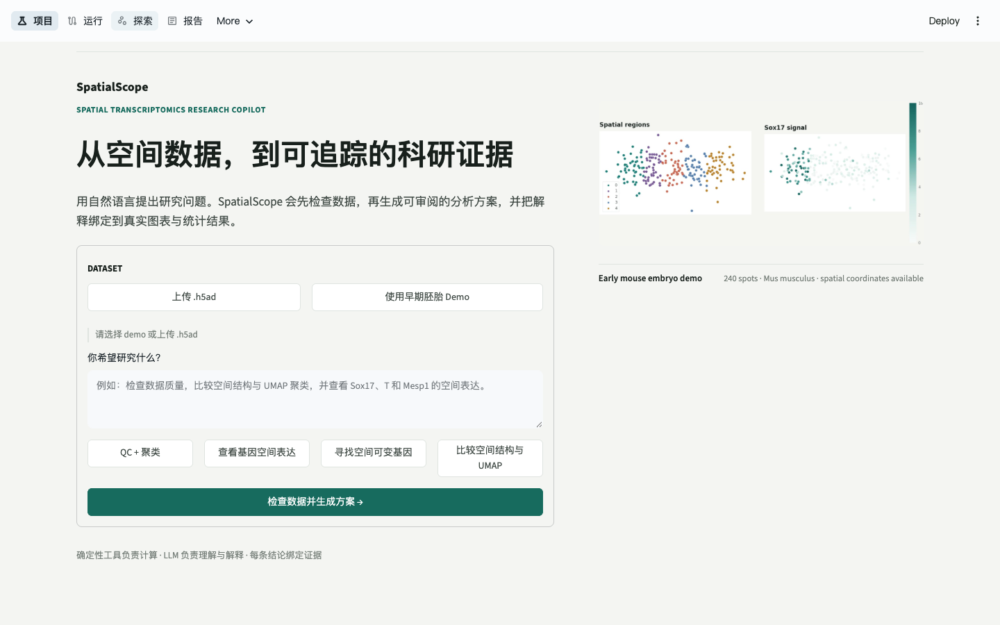

# SpatialScope

[](https://github.com/seu-yolo/spatialscope-agent/actions/workflows/ci.yml)

SpatialScope is a conversational, evidence-grounded workspace for spatial transcriptomics.



Natural-language question -> reviewable plan -> deterministic analysis -> linked spatial evidence -> reproducible report.

The v6 product surface rebuilds the app around a Chinese-first research journey: Project, Run, Explore, Report, with Advanced kept separate for provenance. The scientific core remains LangGraph-orchestrated and OpenAI-compatible LLM-ready; deterministic fallback mode still supports safe demos and tests without exposing secrets.

Project site: `https://seu-yolo.github.io/spatialscope-agent/`

Interactive deployment guide: [`DEPLOYMENT.md`](DEPLOYMENT.md)

## Quick Launch

```bash
conda activate spatialscope-agent
scripts/run_app.sh
```

Open `http://localhost:8501`, choose the embryo demo, write or select a research question, review the dataset-aware plan, run it, then explore linked Spatial + UMAP evidence and the final Research Brief.

## Capabilities

- OpenAI-compatible LLM interface, configurable for GLM 5.1 or compatible providers
- Safe LLM Control Center with masked key display, provider/model status, fallback explanation, and optional smoke test
- LangGraph workflow with SQLite checkpoints, stable thread IDs, and a deterministic fallback path
- LLM/full-mode research brief, plan proposal, findings synthesis, contextual Copilot, and transparent rule-based fallback
- EvidencePack and ScientificFinding contracts that keep every report finding tied to exact evidence IDs, metrics, excerpts, and caveats
- Open tool registry with tool contracts, preconditions, common failures, and repair strategies
- Structured repair diagnostics for failed or skipped steps, visible in trace, report, and manifest
- Quality Gates and Agent Audit remain available in the Advanced provenance area and output bundle, not in the main research workflow
- Dataset Card (`dataset_card.html`/`dataset_card.json`/`DATASET_CARD.md`) for data suitability, schema preview, spatial-coordinate status, recommended run depth, and privacy boundary
- Human Review notes with decision, confidence, tags, Quality Gate overrides, reviewer comments, and bundle integration
- `.h5ad` dataset inspection, QC, preprocessing, UMAP, Leiden clustering, marker genes
- Spatial cluster and gene expression visualization
- Gene fuzzy matching repair and gene panel plots
- Candidate cluster annotation suggestions from ranked marker genes and a compact marker lexicon when explicitly requested
- Optional SVG and neighborhood enrichment when Squidpy is available
- Spatial Storyboard (`storyboard.html`/`storyboard.json`) that turns key figures into a presentation-oriented visual narrative
- Run Replay Recipe (`RERUN.md`, `rerun_recipe.json`, `rerun.sh`) for safe, secret-free reruns
- HTML report, run-level `README.md`, `dataset_card.html`, `DATASET_CARD.md`, `agent_trace.json`, `run_metadata.json`, `parameters.yaml`, `review_notes.json`, `agent_audit.json`, `artifact_manifest.json`
- Artifact Audit with file existence, size, kind counts, missing-artifact warnings, and bundle status
- Complete `run_bundle.zip` export for report, trace, metadata, figures, tables, and reproducibility assets
- CLI and a polished Streamlit analysis workspace with Project, Run, Explore, Report, and Advanced pages
- Run Library, historical run rehydration, and Run Compare for reproducibility bundles and side-by-side audit
- Streamlit Demo Launchpad for one-click standard showcase runs on bundled synthetic spatial data

## Setup

```bash
conda env create -f environment.yml
conda activate spatialscope-agent
python -m pip install -e ".[dev]"
cp .env.example .env
```

`environment.yml` installs the stable core environment: Streamlit, LangGraph, Scanpy,
AnnData, plotting, reporting, and tests. The advanced Squidpy extension can be added
after the core demo is working:

```bash
conda env update -n spatialscope-agent -f environment-squidpy.yml
```

If Squidpy is not installed, Advanced Mode records SVG/neighborhood steps as
structured warnings instead of crashing.

Edit `.env`:

```bash
SPATIALSCOPE_LLM_API_KEY=...
SPATIALSCOPE_LLM_BASE_URL=...
SPATIALSCOPE_LLM_MODEL=glm-5.1
SPATIALSCOPE_LLM_TIMEOUT_SECONDS=10
SPATIALSCOPE_COPILOT_TIMEOUT_SECONDS=45
SPATIALSCOPE_LLM_MODE=auto
```

Use the base URL from your GLM/OpenAI-compatible provider console. The local `.env`
file is ignored by Git. If no API key is configured, SpatialScope still runs a
rule-based demo planner for smoke tests.

`SPATIALSCOPE_LLM_MODE=auto` uses the full LLM path when a provider is configured
and falls back to deterministic rules when it is not. Use `full` to require the
LLM path for research brief, plan proposal, findings, Copilot, and report
narrative; use `fallback` for rule-based demo and smoke-test runs.

Check LLM configuration without exposing secrets:

```bash
python cli.py llm-check
python cli.py llm-check --json
python cli.py llm-check --live
```

`--live` sends a tiny JSON smoke prompt to the configured provider. Without
`--live`, the command only inspects local configuration and fallback behavior.

## Agent Architecture

SpatialScope uses a LangGraph state machine:

```text
inspect_dataset -> parse_request -> plan_analysis -> review_plan
-> execute_tool -> validate_result -> repair_or_continue
-> interpret -> report
```

`review_plan` uses a real LangGraph interrupt/resume checkpoint. The CLI auto-approves
the generated plan for unattended smoke runs, while Streamlit exposes the pause so the
user can inspect and edit the plan before execution.

The tool layer is registry-driven. Each analysis tool exposes a contract with
preconditions, postconditions, common failures, and repair strategies. The configured
LLM parses the user question into a dataset-aware ResearchBrief; a deterministic
baseline planner turns that brief into a reproducible tool plan unless direct LLM
planning is explicitly enabled.
When a step fails, SpatialScope writes a repair diagnosis with failure category,
likely cause, action taken, and recommended next actions instead of silently
continuing.

The LLM never receives raw expression matrices or raw coordinate matrices. It only
sees dataset summaries, tool contracts, execution summaries, figure/table metadata,
and warnings/errors.

Design references and rationale are summarized in
[`docs/AGENT_DESIGN_REFERENCES.md`](docs/AGENT_DESIGN_REFERENCES.md).
The product direction and quality bar are summarized in
[`docs/PRODUCT_BRIEF.md`](docs/PRODUCT_BRIEF.md).

## Demo Data

Generate a tiny synthetic spatial AnnData file:

```bash
python scripts/create_demo_data.py --output data/demo_tiny.h5ad
```

Download one real, classroom-sized GEO sample:

```bash
scripts/download_real_demo.sh
```

This fetches the official [GSE278603](https://www.ncbi.nlm.nih.gov/geo/query/acc.cgi?acc=GSE278603)
supplementary archive from NCBI GEO, then extracts only
`GSM9046244_Embryo_E7.5_stereo_rep2.h5ad` into `data/`. The extracted sample is
about 31 MB and contains 8190 spots, 16364 genes, E7.5 mouse embryo metadata,
and spatial coordinates stored by the source file as `obsm["X_spatial"]`.
SpatialScope normalizes that convention to `obsm["spatial"]` during loading.

Real-data smoke test:

```bash
python cli.py run \
  --data data/GSM9046244_Embryo_E7.5_stereo_rep2.h5ad \
  --query "Inspect this real E7.5 mouse embryo Stereo-seq spatial transcriptomics dataset. Run quick spatial analysis for Sox17, T, Mesp1 and Pou5f1, then summarize spatial structure and caveats." \
  --mode quick
```

Large data files remain ignored by Git. Keep them local or download them during
deployment/runtime as needed.

## CLI

```bash
python cli.py run \
  --data data/demo_embryo.h5ad \
  --query "检查这个早期小鼠胚胎空间数据的质量，比较空间结构与 UMAP 聚类，并查看 Pou5f1、Sox17、T 和 Mesp1 的空间表达。总结主要观察和局限。" \
  --mode standard
```

Outputs are written to `outputs/runs/<run_id>/`.
Each run includes a handoff-ready `README.md`, a complete `run_bundle.zip`, plus
an `artifact_manifest.json` file that indexes the report,
trace, metadata, parameters, figures, tables, repair diagnostics, Quality Gates,
Agent Audit, Dataset Card, Spatial Storyboard, Run Replay Recipe, Human Review notes, Artifact Audit, and public state bundle.

One-command demo:

```bash
scripts/run_demo.sh
```

## Streamlit

```bash
scripts/run_app.sh
```

Navigation:

1. Project: run the Demo Launchpad, upload/select data, write the research question, tune analysis controls, and generate or directly run a plan.
2. Run: inspect the live LangGraph workflow, execution events, repair/clarification notices, warnings, and run-level evidence metrics.
3. Explore: use linked interactive Spatial and UMAP Plotly views with shared cluster colors, gene/layer controls, evidence-linked findings, and contextual Copilot.
4. Report: read the research question, 3-5 evidence-linked findings, caveats, final interpretation, and download the report/bundle.
5. Advanced: inspect LLM status, telemetry, tool registry, audits, run library, and public state JSON.

## Public Web Deployment

`localhost:8501` is only visible on your own computer. To share a link that anyone
can open, deploy the Streamlit app to a Python-hosting platform.

Recommended path: Streamlit Community Cloud.

1. Make sure the latest `main` branch is pushed to GitHub.
2. Open Streamlit Community Cloud and create a new app from:
   - Repository: `seu-yolo/spatialscope-agent`
   - Branch: `main`
   - Main file path: `app.py`
3. In Advanced settings, choose Python `3.11`.
4. Add secrets in the app settings. Do not commit these values to GitHub:

```toml
SPATIALSCOPE_LLM_PROVIDER = "openai_compatible"
SPATIALSCOPE_LLM_API_KEY = "your_glm_api_key_here"
SPATIALSCOPE_LLM_BASE_URL = "https://open.bigmodel.cn/api/paas/v4"
SPATIALSCOPE_LLM_MODEL = "glm-5.1"
SPATIALSCOPE_LLM_TIMEOUT_SECONDS = "10"
SPATIALSCOPE_COPILOT_TIMEOUT_SECONDS = "45"
SPATIALSCOPE_LLM_MODE = "auto"
```

The repository already includes `environment.yml`, which Streamlit Community Cloud
can use to install the Python dependencies. The deployed app will get a public
`*.streamlit.app` URL.

For grading, use the Streamlit URL as the interactive app link and the GitHub
Pages URL as the static project overview. After deployment, add the Streamlit URL
near the top of this README so reviewers can enter the app without cloning.

See [`DEPLOYMENT.md`](DEPLOYMENT.md) for the exact Cloud settings, secrets
template, and post-deploy smoke checks.

GitHub Pages is different: it can host the static project site in `docs/`, but it
cannot run the interactive Streamlit/LangGraph/Scanpy backend by itself.

## Tests

```bash
pytest
```

Full local health check:

```bash
scripts/check_project.sh
```

The lightweight tests avoid requiring Scanpy/Squidpy so they can validate project logic before the full scientific environment is installed.
